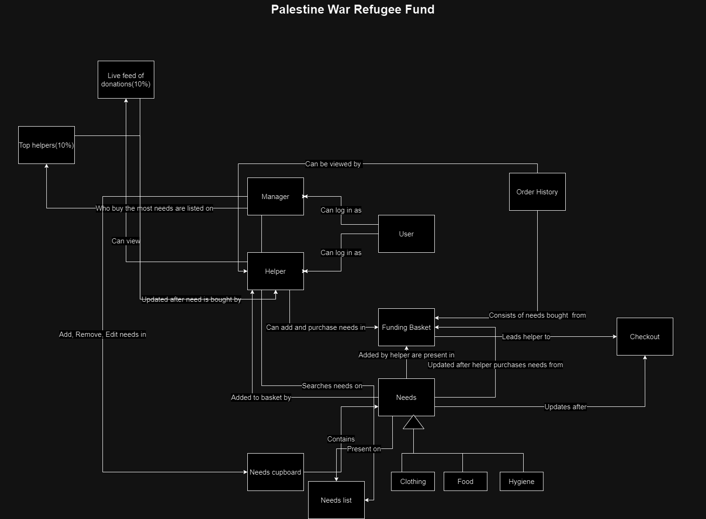

# PROJECT Design Documentation

> _The following template provides the headings for your Design
> Documentation.  As you edit each section make sure you remove these
> commentary 'blockquotes'; the lines that start with a > character
> and appear in the generated PDF in italics but do so only **after** all team members agree that the requirements for that section and current Sprint have been met. **Do not** delete future Sprint expectations._

## Team Information
* Team name: Team 3
* Team members
  * Carter Erwin
  * Hari Acath
  * Matthew Saddick
  * Johnathan Liu

## Executive Summary
To start Matthew made a Credentials class for the model. This gave us a data structure to check if a user was an admin or not. Then Carter started the UI by referencing the Tour-of-heros source code. Also making additions so that when needs are created the new fields for cost, quantity, and type. Carter made a login page as well as an a page for admins to be redirected to where they can add and delete needs as well as delete users.

### Purpose
>  _**[Sprint 2 & 4]** Provide a very brief statement about the project and the most
> important user group and user goals.
Sprint 2: the most important functions for UFund will be the needs cupboard and being able to add/delete/edit the needs (for only Managers) as well as for helpers to be able to put the needs in their basket.
> Sprint 4: This project is intended to act as a fundraiser for Palestinian refugees. Our ideal goal is to have helpers be able to checkout the good properly and have admins be able to manage the basket of goods.

### Glossary and Acronyms
> _**[Sprint 2 & 4]** Provide a table of terms and acronyms._

| Term | Definition |
|------|------------|
| SPA | Single Page |

## Requirements

This section describes the features of the application.

> _In this section you do not need to be exhaustive and list every
> story.  Focus on top-level features from the Vision document and
> maybe Epics and critical Stories._
Needs cupboard
Admin login
Users being stored
Editing Needs
Checkout

### Definition of MVP
> _**[Sprint 2 & 4]** Provide a simple description of the Minimum Viable Product._
Sprint 2 MVP: Able to sign in either as a helper or a manager, then view needs cupboards as either. Managers can add or remove needs to and from the needs cupboard. While helpers can add needs to their funding baskets. Then helpers may checkout and after completing checkout, the needs will be removed from the cupboard.
Sprint 4 MVP: Able to sign in as an admin or helper. They can also create new accounts with unqiue usernames. Admin may add or remove needs from the cupboard. Helpers are able to checkout. 
### MVP Features
>  _**[Sprint 4]** Provide a list of top-level Epics and/or Stories of the MVP._
> 1. User login and create account
> 2. Admin remove/add needs to needs cupboard
> 3. Helper checking out needs
> 4. Updating/searching for needs
> 5. Donation history

### Enhancements
> _**[Sprint 4]** Describe what enhancements you have implemented for the project._
> 1. Our first enhancement is a leaderboard made up of those with the highest dollar amount donated
> 2. Helpers being able to view total amount raised.

## Application Domain

This section describes the application domain.

> _**[Sprint 2 & 4]** Provide a high-level overview of the domain for this application. You
> can discuss the more important domain entities and their relationship
> to each other._

## Architecture and Design

This section describes the application architecture.

### Summary

The following Tiers/Layers model shows a high-level view of the webapp's architecture. 
**NOTE**: detailed diagrams are required in later sections of this document.
> _**[Sprint 1]** (Augment this diagram with your **own** rendition and representations of sample system classes, placing them into the appropriate M/V/VM (orange rectangle) tier section. Focus on what is currently required to support **Sprint 1 - Demo requirements**. Make sure to describe your design choices in the corresponding _**Tier Section**_ and also in the _**OO Design Principles**_ section below.)_

The web application, is built using the Model–View–ViewModel (MVVM) architecture pattern. 

The Model stores the application data objects including any functionality to provide persistance. 

The View is the client-side SPA built with Angular utilizing HTML, CSS and TypeScript. The ViewModel provides RESTful APIs to the client (View) as well as any logic required to manipulate the data objects from the Model.

Both the ViewModel and Model are built using Java and Spring Framework. Details of the components within these tiers are supplied below.

### Overview of User Interface

This section describes the web interface flow; this is how the user views and interacts with the web application.

> _Provide a summary of the application's user interface.  Describe, from the user's perspective, the flow of the pages in the web application._
Upon entering the webpage, the user is brought to the sign in page where they type in their username and password and then can press a button to login. If the user is recognized as an admin then they are redirected to the adminpage where they can edit the needs cupboard and remove and users. Then either type of user can go to the dashboard and see the top needs, as well as search through the cupboard, view the cupboard as a whole, or checkout what they have in their basket. 

### View Tier
> _**[Sprint 4]** Provide a summary of the View Tier UI of your architecture.
> Describe the types of components in the tier and describe their
> responsibilities.  This should be a narrative description, i.e. it has
> a flow or "story line" that the reader can follow._
> The user is initially met with a log in page. The user will have the option to enter either a new account or sign into an existing on. If the user is an admin, logging in with admin credentials will bring them to the admin page, which has options to add needs to the need cupboard. If the user is a helper, they will have access to the needs cupboard where they can search for existing needs and purchase the needs. A helper also has their own basket consisting of the needs only they have currently added. Both the user and admin are able to see purchase history and the leaderboard of all purchased needs. 

> _**[Sprint 4]** You must  provide at least **2 sequence diagrams** as is relevant to a particular aspects 
> of the design that you are describing.  (**For example**, in a shopping experience application you might create a 
> sequence diagram of a customer searching for an item and adding to their cart.)
> As these can span multiple tiers, be sure to include an relevant HTTP requests from the client-side to the server-side 
> to help illustrate the end-to-end flow._
> 1. Login Sequence Diagram
> 
> 2. Checkout Sequence Diagram
> 
> 3. Add need sequence Diagram
> 

> _**[Sprint 4]** To adequately show your system, you will need to present the **class diagrams** where relevant in your design. Some additional tips:_
 >* _Class diagrams only apply to the **ViewModel** and **Model** Tier_
>* _A single class diagram of the entire system will not be effective. You may start with one, but will be need to break it down into smaller sections to account for requirements of each of the Tier static models below._
 >* _Correct labeling of relationships with proper notation for the relationship type, multiplicities, and navigation information will be important._
 >* _Include other details such as attributes and method signatures that you think are needed to support the level of detail in your discussion._

### ViewModel Tier
> _**[Sprint 1]** List the classes supporting this tier and provide a description of there purpose._

> _**[Sprint 4]** Provide a summary of this tier of your architecture. This
> section will follow the same instructions that are given for the View
> Tier above._
> The ViewModel Tier is comprised of the user services and the needs services which interact with the View Tier and the Model Tier. They interact with the controllers on the the backend and relay that information to the UI on the front end. 

> _At appropriate places as part of this narrative provide **one** or more updated and **properly labeled**
> static models (UML class diagrams) with some details such as critical attributes and methods._
> 

### Model Tier
> _**[Sprint 1]** List the classes supporting this tier and provide a description of there purpose._

> _**[Sprint 2, 3 & 4]** Provide a summary of this tier of your architecture. This
> section will follow the same instructions that are given for the View
> Tier above._
> Sprint 2: The model consists of User and Need classes to represent their respective objects, as well as a main class UFund that has a list of users and needs and can perform actions on both.
> Sprint 3: We are still using the same model architecture, we have just added new functions to the user class such as login and basket related tasks
> Sprint 4: The model has UFund, Needs, and Users. There are respective controllers for Needs and Users. 

> _At appropriate places as part of this narrative provide **one** or more updated and **properly labeled**
> static models (UML class diagrams) with some details such as critical attributes and methods._
> 

## OO Design Principles

> _**[Sprint 1]** Name and describe the initial OO Principles that your team has considered in support of your design (and implementation) for this first Sprint._
1. Single Responsibility - Object Oriented design principle that essentially dictates each module should only respond to one actor.
2. Controller - Assign responsibility of responding to system events to a non user-interface class.

> _**[Sprint 2, 3 & 4]** Will eventually address upto **4 key OO Principles** in your final design. Follow guidance in augmenting those completed in previous Sprints as indicated to you by instructor. Be sure to include any diagrams (or clearly refer to ones elsewhere in your Tier sections above) to support your claims.
1. Single Responsibility - Single responsibility is the design principle that says each model should respond to a single class or group. We follow this principle in sprint 2 by having each of our significant classes (Need, Ufund, and User) interact with with only their respective controller. By doing so, only one class has access to the memory in the model and allows for a simple and direct design. In the coming sprints there will definitely be new classes in the model. We plan to use more controller classes for the upcoming data in order to enforce the principle of single responsibility.
2. Controller - This design principle puts the responsibility of handling system events on non user-interface classes. We follow this principle by using a model and controller to handle the interactions with the user. User actions go through the controller, which then changes the model and updates the view. We will continue using this architecture in the future sprints as a means to enforcing this design principle.
3. Open/Closed - The Open/Closed Principle refers to making your code open for extension, but closed to modification. We did this throughout our backend and frontend by making sure that instead of changing classes we already had, we created new classes/files to develop new functionalities. Ex: Added checkout classes throughout the stack instead of changing current user basket classes.
4. Information Expert - We made sure the classes that had the information were the ones completing the tasks. All actual tasks were handled in the model section rather than in the controller or persistence sections since the model held the physical information of the objects. We used DAOs as a middle ground to take in information from the controller and then send it to the model which acted on the information

> _**[Sprint 3 & 4]** OO Design Principles should span across **all tiers.**_
Sprint 3: We have done a decent job of using all 4 design priciples and modeling all our tiers with them in mind
> Sprint 4: OO design principles single responsiblity, controller, /todo, /todo are implemented across our application. 

## Static Code Analysis/Future Design Improvements
> _**[Sprint 4]** With the results from the Static Code Analysis exercise, 
> **Identify 3-4** areas within your code that have been flagged by the Static Code 
> Analysis Tool (SonarQube) and provide your analysis and recommendations.  
> Include any relevant screenshot(s) with each area._
> 
>
> 1. In Reliability, sonarQube identifies two methods that could potentially return a null pointer exception. We did not catch this at first and would reccomend using a try catch to handle a null pointer exception.
> 
> 2. In maintainability, sonarQube identifies some methods that use a string URL "GET/users" and "DELETE/users". We should instead replace this with a constant as it would be better for maintainability.
> 
> 3. In maintainability, sonarQube also identifies another high risk. It reccomends making any method with the "nextid" field to be static. This makes complete sense as there should be only one value of this across all instances of the class anyways, making it static only makes it easier to manage rather than jumping through the hoops we did.
> 

> _**[Sprint 4]** Discuss **future** refactoring and other design improvements your team would explore if the team had additional time._

## Testing
> _This section will provide information about the testing performed
> and the results of the testing._
> We were able to get testing done for 82% of the existing code. Overall the testing was successful with most tests showing the appropriate assertions. Some testing had to get deleted due to issues that would not allow for generation of the code coverage report. 

### Acceptance Testing
> _**[Sprint 2 & 4]** Report on the number of user stories that have passed all their
> acceptance criteria tests, the number that have some acceptance
> criteria tests failing, and the number of user stories that
> have not had any testing yet. Highlight the issues found during
> acceptance testing and if there are any concerns._
> Completed: Remove Need, Add Need, Edit Need, Checkout, Add to basket, User login, Admin login, Create account
> Not tested: Leaderboard

### Unit Testing and Code Coverage
> _**[Sprint 4]** Discuss your unit testing strategy. Report on the code coverage
> achieved from unit testing of the code base. Discuss the team's
> coverage targets, why you selected those values, and how well your
> code coverage met your targets._
> For unit testing we focused on what the backend methods should provide given a value. Some type conversions were difficult to manage so for some parts of testing, rather than test for an array of specific objects, we tested for the size of the array and compared only parts of the object (other parts were left as null). We were able to cover 82% of the code base as some testing had to be deleted because the report would not generate if there are failed unit tests. 

>_**[Sprint 2 & 4]** **Include images of your code coverage report.** If there are any anomalies, discuss
> those._

## Ongoing Rationale
>_**[Sprint 1, 2, 3 & 4]** Throughout the project, provide a time stamp **(yyyy/mm/dd): Sprint # and description** of any _**mayor**_ team decisions or design milestones/changes and corresponding justification._
(03/19/24 Carter Erwin, Sprint 2): Sprint 2 has been a big learning experience with me. I now understand a lot of the front end interworkings after previously having no html or ts experience. I was able to complete all of our front end development that we were able to present. However we did not reach the MVP.
>
(04/3/24 Matthew Saddick, Sprint 3): Spring 3 has proved very challenging for us as I don't think we were at a good enough spot at the conclusion of sprint 2 due to most of us not fully understanding everything. In terms of working together and figuring bugs/problems out as a team, I think we have considerably improved this sprint. I revamped our backend to be more understandle and implemented many new functionalities, but there were some conceptual errors so we decided to revert back to our original design while still taking ideas and some functions from the said backend. We were able to reach MVP once we were able to store the current user and properly checkout.

(04/17/24 Johnathan Liu, Sprint 4): Sprint 4 was a nice breathe of fresh air compared to the other sprints. This sprint felt like much more of a bureaucratic process with much of the work being documentation. Since this sprint mainly consisted of documentation, we did not have changes to our application. 
